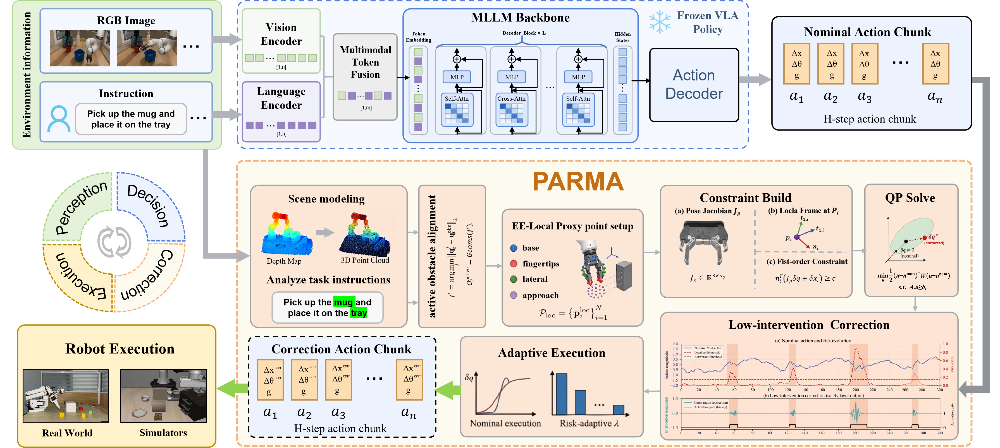
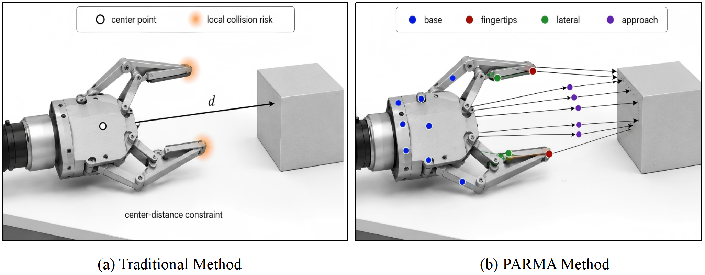

<div align="center">

# 🤖 PARMA

[](https://doi.org/10.1109/LRA.2026.3734928)

**An Inference-Time, Pose-Aware Safety Layer for Vision-Language-Action Policies**

*Code is coming soon.*

</div>

## Overview

PARMA is an inference-time, pose-aware safety layer for vision-language-action
(VLA) robot policies. It receives nominal action chunks from a policy server,
constructs local geometric safety constraints, filters the selected action,
and executes the result in a LIBERO-compatible simulator.

The framework connects policy prediction with geometric action correction.
A frozen VLA policy proposes actions, while PARMA uses local scene geometry
and pose-aware constraints to adjust the selected action before execution.

<p align="center">
  
</p>

*Figure 1. Overview of PARMA, from nominal VLA actions to pose-aware geometric
constraints, risk-adaptive correction, and execution.*

## Method Highlights

- **Pose-aware geometry.** Local proxy points represent the gripper's spatial
  extent and orientation for six-degree-of-freedom (6-DoF) action filtering.
- **Geometric action filtering.** A control barrier function quadratic program
  (CBF-QP) filters nominal actions using local safety constraints.
- **Risk-adaptive correction.** Constraint selection, clipping, and blending
  regulate the intervention applied to the nominal action.

Comparisons cover nominal policy execution, center-point QP, artificial
potential fields (APF), ellipsoid CBF-QP, and proxy-APF methods.
Object-aware, arm-aware, and feedback-triggered replanning extensions remain
experimental.

## Pose-Aware Local Proxy Points

A center-distance constraint measures clearance from a single reference point
and can miss local collision risks at the fingertips. PARMA represents the
gripper with local proxy points covering the **base**, **fingertips**,
**lateral regions**, and **approach direction**, allowing constraints to
reflect the gripper's geometry and pose.

<p align="center">
  
</p>

*Figure 2. Center-distance constraints (left) and PARMA's pose-aware local
proxy points (right).*

## SO101 Real-Robot Demonstration

We provide the complete real-robot demonstration of PARMA on the SO101 platform. 
The video presents representative physical executions under challenging manipulation 
scenarios and includes matched comparisons among nominal execution, center-point 
correction, and PARMA. It provides a qualitative view of how the proposed pose-aware, 
gripper-local correction reduces undesirable gripper--obstacle interactions while 
preserving the task intent of the upstream VLA policy.

The demonstrations complement the 600-trial SO101 feasibility study reported in the paper.

### Full Demonstration Video

| PARMA on the SO101 Platform |
| *Complete real-robot demonstration, including representative matched executions and failure cases.* |


https://github.com/user-attachments/assets/dce7e38b-70db-4a68-a5fc-cbf19135bf30


## 🌱 Code Availability

**Code is coming soon.**

This repository currently presents the research overview and method
illustrations. The implementation, installation guide, and usage instructions
will be added in a future update.


## Citation

If you find our work on PARMA helpful for your research, please consider citing our IEEE RA-L paper:

```bibtex
@article{li2026parma,
  title={PARMA: A Pose-Aware Risk Mitigation Approach for End-Effector Execution in Vision-Language-Action Models},
  author={Shuo Li and Jialiang Fu and Nianwen Ning and Le Fu and Lei Shi and Zhou Yi},
  journal={IEEE Robotics and Automation Letters},
  year={2026},
  doi={10.1109/LRA.2026.3734928},
  publisher={IEEE}
}
```
